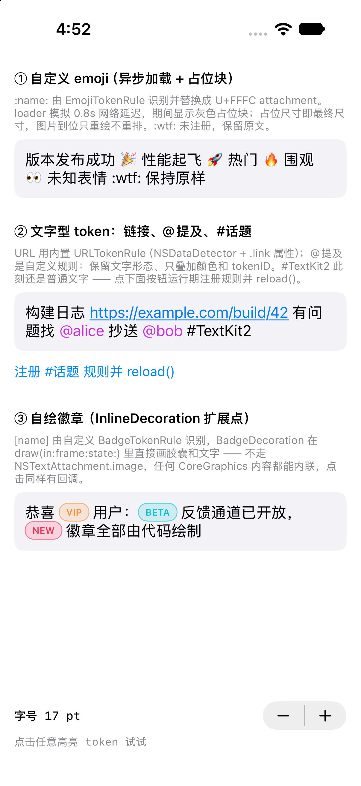

# RichTextLabelDemo

`RichTextLabel` —— 基于 **TextKit 2 排版 + CALayer 绘制** 的 `UILabel` 替代品，支持自绘内联元素（自定义 emoji、徽章）和任意可点击 token。本仓库同时包含一个覆盖全部扩展点的演示 App。

> **声明**：本项目全部代码与文档均由 AI（Claude Code）编写，没有人类参与。

## 特性

- **内联自绘元素**：图标由 `InlineDecoration` 协议接管绘制，不受 `NSTextAttachment.image` 的能力限制 —— 异步加载、程序化绘制、后续接动画都可以。占位尺寸即最终尺寸，图片到位**只重绘、不重排**，行高不跳动。
- **任意 token 可点击**：不止 `.link`。emoji、@提及、徽章都能响应点击，回调携带 `identifier` / `payload` / `range`。命中测试区分两套坐标系：attachment 型走 `frameForTextAttachment(at:)`（fragment 坐标），文字型走 `enumerateTextSegments`（container 坐标）。
- **排版与绘制分离**：排版完全交给 TextKit 2，绘制发生在自定义 `TextDisplayLayer`；`layoutQueue` 可选把排版派发到后台队列。
- **规则化扩展**：注册一条 `TextTokenRule` 就能让 label 支持一种新的内联内容，无需改 label 本身；支持在设置 `text` 之后注册新规则并 `reload()` 热生效。
- **Auto Layout 友好**：`intrinsicContentSize` / `sizeThatFits(_:)` 可用，多行自适应高度时设置 `preferredMaxLayoutWidth`（语义同 `UILabel`）。
- **零依赖**：纯 UIKit + TextKit 2，演示 App 不需要任何图片资源（emoji 由代码现场渲染）。

## 目录结构

```
RichTextLabelDemo/
├── RichTextKit/
│   ├── RichTextLabel.swift      # UIView 子类：TextKit 2 对象网络、外观属性、命中测试、点击分发
│   ├── RichTextRenderer.swift   # 自定义 layout fragment vending + 整篇文档绘制 + TextDisplayLayer
│   ├── InlineDecoration.swift   # 扩展点①：内联自绘协议 + ImageDecoration + DecorationAttachment
│   └── TokenRule.swift          # 扩展点②：TextTokenRule 协议 + TokenRegistry + 内置 emoji/URL 规则
├── ViewController.swift         # 演示 App（三组示例 + 字号步进器 + 点击状态栏）
└── Assets.xcassets / Storyboard # 工程模板资源
```

### 数据流

```
text（纯文本）
  → TokenRegistry.attributedString(from:)   按规则扫描、排序、去重叠
      ├─ decoration(for:) ≠ nil → 替换成单个 U+FFFC，挂 DecorationAttachment（退格一次删整个 emoji）
      └─ decoration(for:) = nil → 保留原文字，叠加 attributes(for:) + tokenID/tokenPayload
  → NSTextContentStorage → NSTextLayoutManager（vending RichTextLayoutFragment）
  → TextDisplayLayer.draw → fragment.draw(at:in:) 先画文字，再补画 decoration
```

## 快速上手

```swift
let label = RichTextLabel()
label.registry.register(EmojiTokenRule(prefix: "emoji_"))  // :smile: → asset 里的 emoji_smile
label.registry.register(URLTokenRule())
label.onTokenTap = { token in
    switch token.identifier {
    case "url":   UIApplication.shared.open(URL(string: token.payload)!)
    case "emoji": print("tapped \(token.payload)")
    default: break
    }
}
label.text = "构建成功 :tada: 详见 https://example.com/build/1"
```

注意：**先注册规则，再设置 `text`**；顺序反了就调用 `label.reload()` 重新编译。

### 扩展点①：`InlineDecoration`

任何能在文本行内自绘的内容（自定义 emoji、等级徽章、内联进度条……）：

```swift
final class MyDecoration: InlineDecoration {
    var invalidationHandler: (() -> Void)?          // 内容异步变化时触发宿主重绘（由 label 注入）

    func layoutBounds(in context: DecorationLayoutContext) -> CGRect {
        Self.centeredBounds(size: size, font: context.font)  // origin.y 相对基线，向上为正
    }

    func draw(in context: CGContext, frame: CGRect, state: DecorationDrawState) {
        // frame 已转换到 layer 坐标系（左上原点，单位 pt），直接画
    }

    func prepare() { /* 写入宿主时提前启动加载/解码，别等 draw 才加载 */ }
}
```

内置 `ImageDecoration` 支持同步图（`.image`）和任意线程回调的异步加载（`.async`），异步期间画灰色占位块。

### 扩展点②：`TextTokenRule`

一条规则 = 识别 +（可选）自绘 +（可选）附加属性：

```swift
final class MentionTokenRule: TextTokenRule {
    let identifier = "mention"                       // 用于点击事件分发

    func matches(in text: String) -> [TokenMatch] { … }        // 正则扫描
    func attributes(for match: TokenMatch) -> [NSAttributedString.Key: Any] {
        [.foregroundColor: UIColor.systemPurple]     // 文字型：保留原文，只叠属性
    }
    // func decoration(for:font:) 返回非 nil → attachment 型：替换成 U+FFFC 自绘
}

label.registry.register(MentionTokenRule())
```

注册顺序即优先级：区间重叠时先注册的规则胜出。内置规则：

| 规则 | 形态 | 说明 |
|---|---|---|
| `EmojiTokenRule` | attachment 型 | 识别 `:name:`；`isKnownName` 校验失败保留原文；尺寸默认跟随字号（`sizeRatioToFont = 1.2`） |
| `URLTokenRule` | 文字型 | `NSDataDetector` 识别，叠加 `.link` + 蓝色下划线 |

## 演示 App

运行 Demo target，从上到下三组示例：

1. **自定义 emoji**：`EmojiTokenRule` + 模拟 0.8s 网络延迟的异步 loader，先看到占位块再看到真图（不重排）；`:wtf:` 未注册，保留原文。没有图片资源也能跑 —— `DemoEmoji` 把系统 unicode emoji 现渲染成图。
2. **文字型 token**：URL（点击直接打开）、`@提及`（紫色高亮）；按钮演示**运行期注册 `#话题` 规则 + `reload()`** —— 点击前 `#TextKit2` 只是普通文字。
3. **自绘徽章**：`BadgeTokenRule` 识别 `[vip]` `[beta]` `[new]`，`BadgeDecoration` 纯 CoreGraphics 画胶囊 + 描边 + 文字，点击同样有回调。

底部：字号步进器（13–24pt，`font` didSet → 用原始纯文本重新编译，图标随字号缩放）+ 状态栏显示最近一次点击的 `identifier / payload / range`。

## 环境要求

- Xcode 27（本仓库以此验证编译），Swift 5，deployment target iOS 15.0
- 旧版 SDK 若将 TextKit 2 API 标注为 iOS 16+，把 deployment target 提到 16.0 即可
- 无第三方依赖

## 已知边界

- `setAttributedText(_:)` 入口跳过 token 解析，之后改 `font` / `textColor` **不会**重新编译内容 —— 属性由调用方自己掌握；需要重编译请走 `text` 入口。
- `reload()` 适用场景：设置 `text` 之后才注册新规则、异步替换了 emoji 图集。
- 绘制走全量枚举 fragment（label 非滚动、内容全可见）；要在滚动容器里做长文档，需换成 `NSTextViewportLayoutController` 才能拿到惰性布局的收益。
- 异步排版（`layoutQueue`）下 `intrinsicContentSize` 首次读取可能是估算值，排版完成后需自行 `invalidateIntrinsicContentSize()`。

# Screenshot

